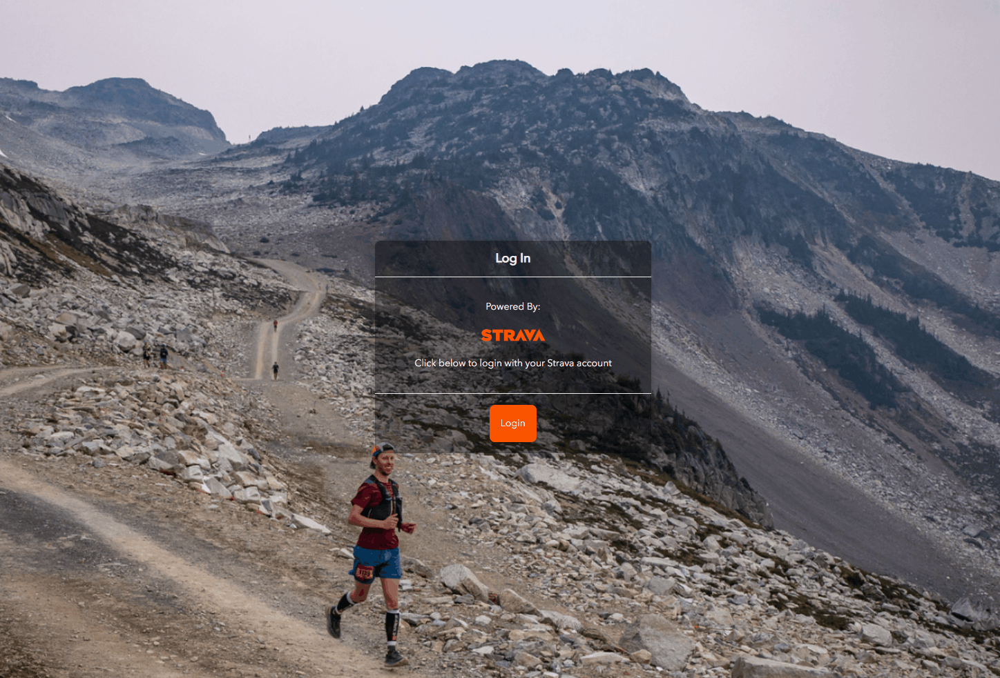
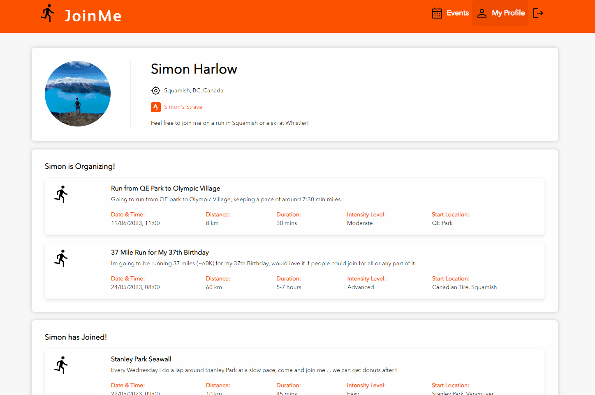
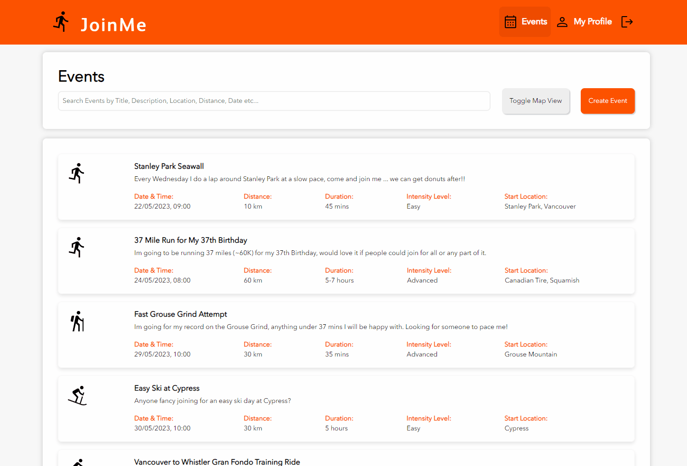
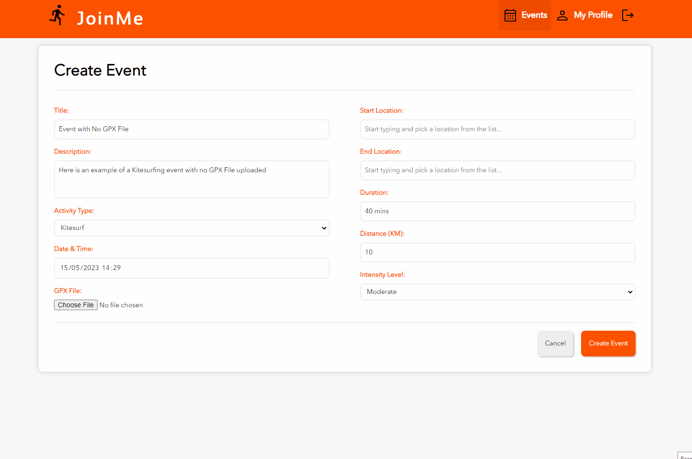
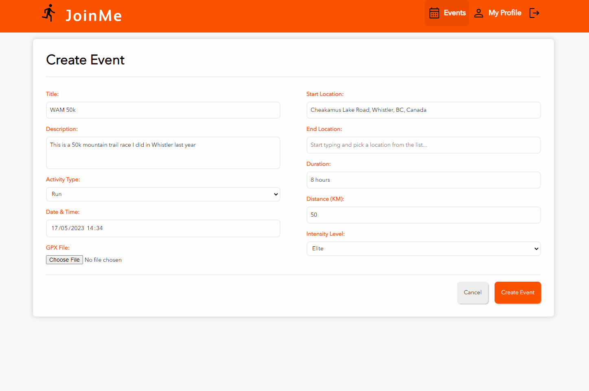
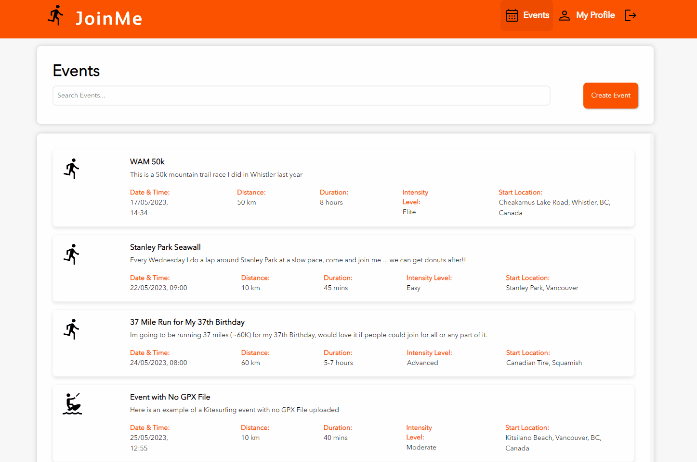

# JoinMe

**Contens**
- [JoinMe](#joinme)
  - [📝 Description](#-description)
  - [⭐ Features](#-features)
  - [🧰 Tech Stack](#-tech-stack)
      - [Client Side](#client-side)
      - [Server Side](#server-side)
  - [📜 API Documentation](#-api-documentation)
  - [🗨️ Capstone Presentation](#️-capstone-presentation)
  - [🖼️ Screenshots \& GIFs](#️-screenshots--gifs)
      - [Login \& Welcome screen](#login--welcome-screen)
      - [My Profile](#my-profile)
      - [Events](#events)
      - [Create Event (no GPX Upload)](#create-event-no-gpx-upload)
      - [Create Event (with GPX Upload)](#create-event-with-gpx-upload)
      - [Join Event \& Comment](#join-event--comment)
      - [Events Others Have Joined](#events-others-have-joined)
  - [🙏 Acknowledgements](#-acknowledgements)
  - [📦 Local Setup](#-local-setup)
      - [Client Side .env](#client-side-env)
      - [Server Side .env](#server-side-env)
      - [MySQL DB \& Data](#mysql-db--data)


## 📝 Description
For my BrainStation Capstone Project, I created JoinMe, a unique social platform that allows users to connect with others who share their passion for sports and the outdoors.

JoinMe is a Strava add-on that allows users to post upcoming events that others can discover and join. Users can participate in events, leave comments, and access event details, including an embedded map that displays the GPX route if uploaded by the organizer.

## ⭐ Features

* Search for events by virtually any metric
* See gpx route of event on interactive map
* Join and comment on events posted by other users
* See what events friends have joined

## 🧰 Tech Stack

#### Client Side

* React.js
* SAAS
* Google-Maps API *(for places auto-complete on event form)*
* Leaflet *(map rendering and GPX route display)*

#### Server Side

* node.js
* express
* knex.js
* mysql

## 📜 API Documentation

[All of the API's used in the project can be found here](https://documenter.getpostman.com/view/24908455/2s93eePonf)

## 🗨️ Capstone Presentation

[The presentation slides for my Capstone Presentation can be found here](https://pitch.com/public/abae9f70-b437-46a7-be45-43099ef7fb44)

## 🖼️ Screenshots & GIFs

#### Login & Welcome screen


#### My Profile


#### Events


#### Create Event (no GPX Upload)


#### Create Event (with GPX Upload)


#### Join Event & Comment


#### Events Others Have Joined


## 🙏 Acknowledgements

I would like to thank all the teachers and TA's for helping me during this bootcamp.

* [Adam Ginther](https://github.com/GInTher)
* [Paolo Riberio](https://github.com/PCRib)
* [Rajat Bansal](https://github.com/rjtbansal)
* [Roisin O'Neill](https://github.com/RoisOneill)
* [Jason Yang](https://github.com/projectyang)

Any feedback on JoinMe is welcomed as its my first true solo development project.

Find me on [LinkedIn](https://www.linkedin.com/in/simon-harlow/)


#############################################################

## 📦 Local Setup

Steps to setup local environment for the project

#### Client Side .env

A Google Maps API Key is needed to use the places autofill on the event form. Create a .env file with a google api key in the client folder.

```
REACT_APP_GOOGLE_API_KEY='your api key'
```

#### Server Side .env
Copy this file to an .env file in the server folder and replace the values with your own local configuration.

```
PORT=8080
BACKEND_URL=http://localhost
DB_LOCAL_DBNAME='joinme'
DB_LOCAL_USER='root'
DB_LOCAL_PASSWORD='your local password'
```

#### MySQL DB & Data

Setup a DB called 'joinme' by connecting to your local MySQL server and running the following command:

```
create database joinme;
```

Switch to the joinme db by running command:

```
use joinme;
```

Run the migrations and then insert seed data by running these commands from within the server folder. This will invoke the scripts from the `package.json` file

```
npm run migrate
npm run seed
```
